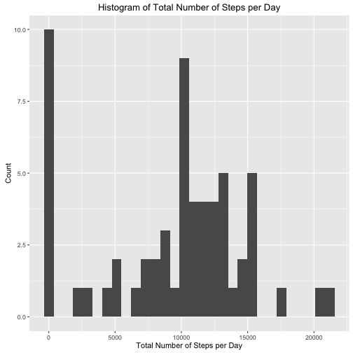
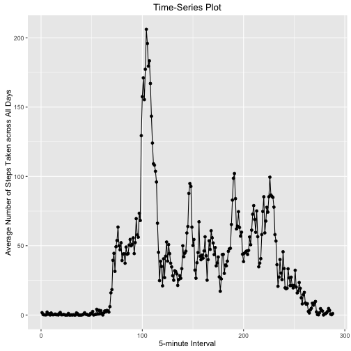
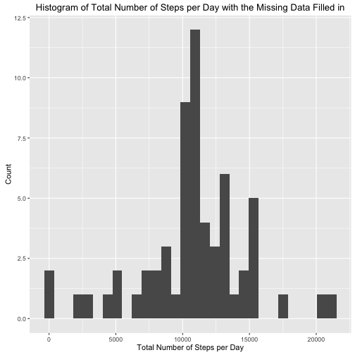
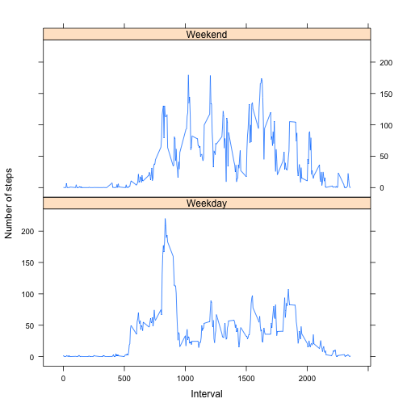

```r
---
title: "Reproducible Research: Peer Assessment 1"
output: 
html_document:
keep_md: true
---


## Loading and preprocessing the data
First I include the required packages, load the data and transform the date variable.
```

```
## Error: <text>:10:7: unexpected symbol
## 9: ## Loading and preprocessing the data
## 10: First I
##           ^
```

```r
library("dplyr")
library("plyr")
library(ggplot2)
library(lattice)

setwd("/Users/North_Point/Dropbox/MOOC/Data_Science/Reporducible_Research/week1")
data <- read.csv("activity.csv")
data$date = as.POSIXct(strptime(data$date, format = "%Y-%m-%d"))
```

## What is mean total number of steps taken per day?

```r
total_step_per_day = ddply(data, .(date), summarize, total_step = sum(steps, na.rm = TRUE))

g1 = ggplot(total_step_per_day, aes(x = total_step)) + geom_histogram() +
        labs(x = "Total Number of Steps per Day") +
        labs(y = "Count") + 
        labs(title = "Histogram of Total Number of Steps per Day")
plot(g1)
```

```
## `stat_bin()` using `bins = 30`. Pick better value with `binwidth`.
```




The mean and median of the total number of steps taken per day are the follows:

```r
average_total_step_per_day = mean(total_step_per_day$total_step)
average_total_step_per_day
```

```
## [1] 9354.23
```

```r
median_total_step_per_day = median(total_step_per_day$total_step)
median_total_step_per_day
```

```
## [1] 10395
```

## What is the average daily activity pattern?

```r
interval_data = mutate(data, interval = as.factor(interval))
interval_data = ddply(interval_data, .(interval), summarize, average_step_per_interval = mean(steps, na.rm = TRUE))
g2 = ggplot(interval_data, aes(x = as.integer(interval), y = average_step_per_interval)) + geom_point() + geom_line() +         labs( x = "5-minute Interval") + labs( y = "Average Number of Steps Taken across All Days")+
        labs( title = "Time-Series Plot")
plot(g2)
```




The 5-minute interval that contains the maximum number of steps on average across all the days in the dataset is:


```r
max_interval = interval_data[which.max(interval_data$average_step_per_interval), "interval"]
max_interval
```

```
## [1] 835
## 288 Levels: 0 5 10 15 20 25 30 35 40 45 50 55 100 105 110 115 120 ... 2355
```

## Imputing missing values


The total number of missing values in the dataset is:


```r
total_num_of_NA = sum(sapply(data$steps,is.na))
total_num_of_NA
```

```
## [1] 2304
```


I use the mean for that 5-minute interval to fillall of the missing values in the dataset. The histogram of the total number of steps taken each day after imputation is


```r
rep_interval_data = rep(interval_data$average_step_per_interval, length(unique(data$date)))
new_data = data
new_data[sapply(data$steps,is.na),]$steps = rep_interval_data[sapply(data$steps,is.na)]
new_total_step_per_day = ddply(new_data, .(date), summarize, total_step = sum(steps))
g3 = ggplot(new_total_step_per_day, aes(x = total_step)) + geom_histogram() +
        labs(x = "Total Number of Steps per Day") +
        labs(y = "Count") + 
        labs(title = "Histogram of Total Number of Steps per Day with the Missing Data Filled in")
plot(g3)
```

```
## `stat_bin()` using `bins = 30`. Pick better value with `binwidth`.
```




Also, I calculated the new mean and median total number of steps taken per day, which are the follows respectively:


```r
new_average_total_step_per_day = mean(new_total_step_per_day$total_step)
new_average_total_step_per_day
```

```
## [1] 10766.19
```

```r
new_median_total_step_per_day = median(new_total_step_per_day$total_step)
new_median_total_step_per_day
```

```
## [1] 10766.19
```


Compare with the meastures from the old dataset, we see both of the old mean (9354.23) and old median (10395) value of total number of steps taken per day have increased to 10766.19 after filling the missing data with the average in that interval.


## Are there differences in activity patterns between weekdays and weekends?


The panel plot characterizes the differences in activity patterns between weekdays and weekends are the follows:

```r
new_data = mutate(new_data, wk = weekdays(date), date = as.POSIXct(date))
new_data = mutate(new_data, wk = ifelse(wk %in% c("Sunday", "Saturdat"), "Weekend", "Weekday"))

weekday_data = ddply(new_data, .(wk, interval), summarize, average_step_per_interval = mean(steps))
xyplot(average_step_per_interval~interval|as.factor(wk), data = weekday_data, type = "l", layout = c(1,2), xlab = "Interval", ylab = "Number of steps")
```


```

